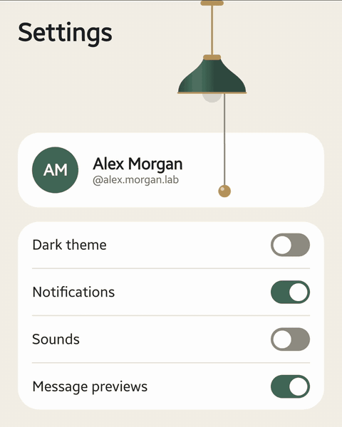
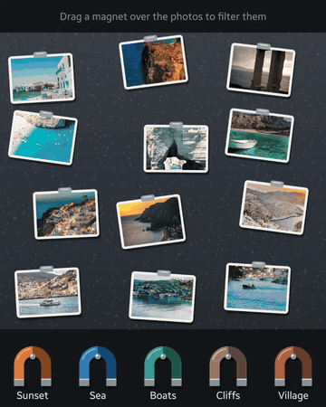
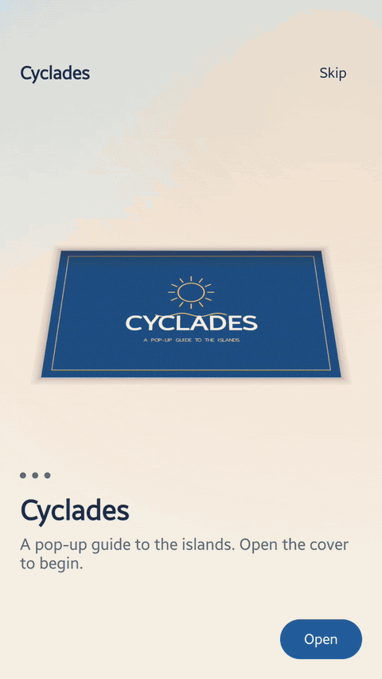

<h1 align="center">compose-lab</h1>

<p align="center">
Compose Multiplatform components, rebuilt from scratch and recorded as short clips.<br>
One Kotlin codebase, the same pixels on Android and iOS.
</p>

<p align="center">
  <a href="https://github.com/DimiVlachos/compose-lab/actions/workflows/ci.yml"></a>
  <a href="LICENSE"></a>
  
  
  
</p>

<p align="center">
  <a href="#nav-bar-corepresentationcomponentsnavbar"></a>
  <a href="#fogged-mirror-corepresentationcomponentsfog"></a>
  <a href="#paper-plane-corepresentationcomponentspaperplane"></a>
</p>

Each component lives in its own package under `composeApp/src/commonMain/kotlin/dev/dimvlachos/lab/core/presentation/components/`, has a demo that plays a timed script, and is covered by common tests that run on the iOS simulator in CI.

| Component | Package | Demo | What it shows |
|---|---|---|---|
| [Nav bar](#nav-bar-corepresentationcomponentsnavbar) | `navbar` | `navbar.all` | A bottom bar of switchable layers: morphing indicator, cutout, collapse on scroll, jelly action button |
| [Profile gallery](#profile-gallery-corepresentationcomponentsgallery) | `gallery`, `imagemorph`, `profile` | `morph.app` | Every open is a shared-element morph, serialised by a morph gate |
| [Fogged mirror](#fogged-mirror-corepresentationcomponentsfog) | `fog` | `fog.mirror.bathroom`, `fog.mirror.camera` | Wipe steam off a mirror; running drops; your live face, cut out on the phone |
| [Page-turn book](#page-turn-book-corepresentationcomponentspageturn) | `pageturn` | `book.turn` | Pages that curl in 3D under the finger, in plain `DrawScope` |
| [Paper plane](#paper-plane-corepresentationcomponentspaperplane) | `paperplane` | `chat.plane` | A chat that sends each message as a folded paper dart |
| [Pull cord](#pull-cord-corepresentationcomponentspullcord) | `pullcord` | `lamp.cord` | Pull a lamp's cord to switch a screen between light and dark |
| [Magnet filter](#magnet-filter-corepresentationcomponentsmagnet) | `magnet` | `magnet.filter` | Drag tag magnets over photos to filter them; snap two together to search for both |
| [Fishing refresh](#fishing-refresh-corepresentationcomponentsfishing) | `fishing` | `feed.fishing` | A pull-to-refresh that isn't a boring spinner: cast a line, haul new cards up from the deep, reel in an empty hook, or snap the line |
| [Pop-up book](#pop-up-book-corepresentationcomponentspopup) | `popup` | `tour.popup` | An onboarding as a pop-up book: paper scenery stands up as a spread opens, and pull tabs sail a boat and spin windmill sails |
| [Moodboard](#moodboard-native-on-both-platforms-moodboard) | `moodboard/` | showcase | A KMP app that shares logic and keeps each platform's UI native |

The scripted fingertip in every clip is `touch/ScriptedTouch.kt`.

<details>
<summary><b>Contents</b></summary>

- [Nav bar](#nav-bar-corepresentationcomponentsnavbar)
- [Profile gallery](#profile-gallery-corepresentationcomponentsgallery)
- [Fogged mirror](#fogged-mirror-corepresentationcomponentsfog)
- [Page-turn book](#page-turn-book-corepresentationcomponentspageturn)
- [Paper plane](#paper-plane-corepresentationcomponentspaperplane)
- [Pull cord](#pull-cord-corepresentationcomponentspullcord)
- [Magnet filter](#magnet-filter-corepresentationcomponentsmagnet)
- [Fishing refresh](#fishing-refresh-corepresentationcomponentsfishing)
- [Pop-up book](#pop-up-book-corepresentationcomponentspopup)
- [Moodboard: native on both platforms](#moodboard-native-on-both-platforms-moodboard)
- [Project structure](#project-structure)
- [Run](#run)
- [Record a clip](#record-a-clip)
- [Envelope](#envelope)
- [Contributing](#contributing)
- [Licence](#licence)

</details>

## Nav bar (`core/presentation/components/navbar/`)


One bar, built from layers that can each be switched on or off; the demo, `navbar.all`, runs them all together. Nothing recomposes while it animates: every animated value is read in the layout or draw phase, so frames climb while the bar recomposes only on a tap.

- **Morphing indicator.** The leading and trailing edges run on different springs.
- **Animated icons.** A circular reveal of the filled icon, with a squash and bounce.
- **Collapse on scroll.** A nested-scroll observer shrinks the bar into a floating pill, and settles it to fully open or fully collapsed on release.
- **Moving cutout.** A notch cut with `Path.combine`, following the bubble. The notch itself rides a calm, non-bouncing centre while the bubble leans into its travel and bulges on landing.
- **Cutout morph.** The notch hugs the bubble as it sinks into the bar, then hands off to an in-bar pill, riding that same calm centre.
- **Action button.** A jelly button squirts out of the bar on tabs that have one, and shrinks the bar to make room.

```kotlin
val items = listOf(
    NavItem(
        label = "Home",
        icon = Res.drawable.ic_home,
        selectedIcon = Res.drawable.ic_home_filled,
        action = NavAction(Res.drawable.ic_add, "New post"),
    ),
    NavItem(label = "Search", icon = Res.drawable.ic_search, selectedIcon = Res.drawable.ic_search),
    NavItem(label = "Saved", icon = Res.drawable.ic_saved, selectedIcon = Res.drawable.ic_saved_filled),
    NavItem(label = "Profile", icon = Res.drawable.ic_profile, selectedIcon = Res.drawable.ic_profile_filled),
)

val scrollState = rememberNavBarScrollState()

AnimatedNavBar(
    items = items,
    selectedIndex = selected,
    onSelect = { selected = it },
    onActionClick = { index -> /* the tapped tab's action fired */ },
    layers = NavBarLayers.All,
    scrollState = scrollState, // also add Modifier.nestedScroll(scrollState.nestedScrollConnection) to your list
)
```

## Profile gallery (`core/presentation/components/gallery/`)


One screen where everything that opens is a shared-element morph, all in one `SharedTransitionLayout`:

- **Photo.** A grid card grows into the full-screen photo and back (a container transform). The corners are paired, so the card's 16 dp and the photo's 0 dp meet halfway instead of a square photo showing through a rounded card. The title and caption follow the photo as it grows.
- **Profile photo.** The avatar zooms into a large circle over a scrim. A pencil button then morphs into a "Change profile photo" dialog, and back into the button.
- **Search.** The search button grows into a bar, and search opens as its own page, cross-fading with the gallery. Recent searches show until the query types in, then the matching photos, which glide into place as each letter narrows them.
- **Collapsing header.** As the grid scrolls, the avatar shrinks into a top bar with a shadow, following the finger.

Taps are serialised by a morph gate: one that arrives mid-morph waits for the morph to land, so an interrupted transition never leaves a stray copy behind. Nothing recomposes while anything morphs or scrolls. The system back gesture closes the topmost layer.

```kotlin
ProfileGallery(
    name = "Alex Morgan",
    portrait = Res.drawable.portrait,
    photos = photos, // List<MorphPhoto>(image, title, caption)
    searchQuery = "xos",
    recentSearches = listOf("Santorini", "Milos", "Hydra"),
    scene = scene, // GalleryScene(photo, avatar, dialog, search)
    onSceneChange = { scene = it },
)
```

The photo morph also ships on its own as `ImageMorph` (`core/presentation/components/imagemorph/`), with `MorphLayers` to switch its fixes on one by one.

## Fogged mirror (`core/presentation/components/fog/`)


> **Try it with your own face.** The clip above is the Bathroom version, but the repo also has a camera version, **Your reflection**. Run the app on an Android phone, open *Fogged mirror → Your reflection*, and wipe the steam to find yourself standing in the bathroom, cut out of your own room on the phone. Leave it, and the steam comes back. Tap **Replay** to watch the clip play over your live face.

A steamed-up bathroom mirror, hanging on a tiled wall above the basin, that you wipe clear with a finger. Two versions share one component:

- **Bathroom** (`fog.mirror.bathroom`): a still bathroom behind the glass. It asks for nothing, and mists slowly back over once you stop wiping.
- **Your reflection** (`fog.mirror.camera`): the live front camera behind the glass, so wiping finds your face, standing in the bathroom: on Android, ML Kit's selfie segmentation cuts you out of each frame on the phone itself, and the bathroom shows behind you instead of your own room. Like the bathroom, it mists slowly back over once you stop wiping. One card explains why it needs the camera before asking; without it, the mirror shows the bathroom's still reflection.

What's on the glass:

- **Fog from a real photo.** Condensation texture from a photo of wet glass, over a blurred, milky copy of the scene behind it.
- **Soft wipes.** Soft-edged strokes follow the finger.
- **Mist.** Once you stop wiping, the steamy room slowly fogs the glass evenly back over. (`FogState` can also fill fog back in from the bottom up, like a breath; the demo doesn't use it.)
- **Running drops.** Now and then a drop gathers, in a range of small sizes, and runs down. The bigger it is, the faster it goes. As it runs it stretches from a sphere into a teardrop, and it cuts a clear trail through the fog behind it. Once it stops, it settles softly into the condensation.
- **Drops meeting a wipe.** A drop that runs into a wiped patch slips just inside, then spreads out slowly and thins away into the wet glass.
- **The clip.** Drops run first, then a hand scrubs a porthole clear, smearing away the drop resting in its path. A soft fingertip marks each touch, like a phone's "show taps". One more drop runs into the porthole and spreads away, then the room mists it all back over, so the clip loops. Replay in **Your reflection** plays the same showcase over your live face, ending with the same mist.

```kotlin
val fog = remember { FogState() }                   // starts fully fogged
val drips = remember(fog) { DripDriver(fog) }       // set drips.glass to the glass's size in dp,
                                                    // then drips.advance(seconds) on each frame

FoggedMirror(
    photo = painterResource(Res.drawable.mirror_view), // or the camera's live Painter
    state = fog,
    beads = { drips.beads },                         // read while drawing: a running drop only redraws
)
```

### Made with Compose

Compose made every part of this simple to build, and the same Kotlin runs on Android and iOS:

- **Blend modes are the whole fog.**
  - Inside an offscreen `graphicsLayer` (`CompositingStrategy.Offscreen`), `BlendMode.DstOut` wipes holes in the fog, `Overlay` lays the condensation texture on top, and `DstIn` thins it.
  - Breath and mist *fill back in* rather than pile up: `DstOut`, then `Plus` through a `SrcIn` mask, in `saveLayer` from `drawIntoCanvas`.
  - That's plain Porter–Duff maths, the same on both platforms.
- **`Modifier.blur` and `ColorFilter.colorMatrix`** turn one `Painter` into the misty copy of the scene. The camera is just another `Painter`, so the live mirror needed no special path.
- **Drops are drawn with ordinary draw calls.** Each teardrop is a `Path` of two cubics and an arc, drawn longer the faster it runs. Its shade, rim, edge light and glint are a filled path, strokes, an arc and a circle, and a settled drop gets a soft `Brush.radialGradient` halo. `withTransform` spreads it as it melts into a wipe.
- **Drawing never triggers recomposition.** Beads are handed over as a lambda and read in `drawBehind`. The fog's marks are a `mutableStateListOf` read in the draw phase, and camera frames sit in snapshot state that only `onDraw` reads. So a running drop or a new frame costs a redraw, not a recomposition.
- **Clocks and gestures are coroutines.**
  - `withFrameNanos` drives the drops and the mist.
  - `snapshotFlow` wakes the drip loop the moment you wipe, and otherwise lets the glass sleep.
  - `pointerInput` with `awaitEachGesture` follows each finger across the glass.
  - `repeatOnLifecycle` keeps the camera on only while the screen is showing.
- **Everything is testable.** `runComposeUiTest` plus `captureToImage` read real pixels: a drop is darker in the middle, a spread one is thinner and wider, and a wipe clears the fog. The drips and the mist run on the test's own frame clock, so a test steps through many seconds of drops frame by frame, exactly the same every run.
- **The mirror hangs on a real wall with ordinary layout.** `BoxWithConstraints` measures the screen. An `Image` with `ContentScale.Crop` and a custom `Alignment` crops the wall photo around the mirror. The glass is a `Box` placed with `Modifier.offset` and `size`, and clipped with `RoundedCornerShape`. So the fog lands exactly on the photo's glass on any screen, and a finger on the tiles wipes nothing.
- **A cut-out is just a blend mode.** The camera's frame and the person mask go into one layer, and `BlendMode.DstIn` keeps only you. A small `Painter` then draws the bathroom behind you, and the fog takes the result like any other picture.
- **`expect`/`actual`** keeps the platform code small: CameraX on Android, a stub on iOS. Everything you see is common code.

What makes Compose so good for this is that nothing here needed a custom view, an OpenGL shader or a platform escape hatch. The fog, the water and the wall are ordinary composables, modifiers and draw calls, laid out, animated and tested like any other screen, and one codebase draws them on both platforms. Compose makes a surface that feels physical and alive just another piece of UI.

## Page-turn book (`core/presentation/components/pageturn/`)


An open book whose pages turn in 3D under your finger, drawn in plain Compose `DrawScope` with no platform canvas, so the same code turns the page on Android and iOS.

- **A leaf of strips.** The turning page is 18 strips hinged end to end. Each one is drawn under its own perspective `Matrix` (the 3×3 projection written into Compose's 4×4 layout), so the page curls instead of flipping as a flat card.
- **The paper stays under your finger.** Take a page anywhere and the spot you took stays under the fingertip as it moves across: each move solves for the turn that puts it there. Seen in perspective, paper lifting off its page first drifts outwards, so the spot is placed as seen from above and then most of the way to the eye's view, and the first move never snaps the page up.
- **Where and how you hold it matters.** The bending lines can lean, fanning out from a point on the spine's line, so one corner peels first and curls tightest. Hold a top or bottom corner and that corner leads; slide your finger along the edge and the hold slides with it, so the lead moves to the other corner. Pull on a slant and the fold lies square to the pull, as paper does. Held near the spine the leaf turns stiff and flat; out at the edge it bends most around your fingers. Let go, and the lean straightens as the page falls, so it lands square.
- **Paper with a spring in it.** In a hand the paper sags back behind the fingers and rolls over calmly when you turn back; flying free, its edge trails in the air. Let go and the bow whips over from one to the other, a flick billows it, and it sways and settles.
- **Let go anywhere.** Past 0.42 of a turn, or on a flick, the page finishes; otherwise it sinks back. Both are critically damped springs, so a page lands without bouncing off the spine, and a page still landing can be caught mid-air.
- **A book of real leaves.** Every sheet is a leaf you can turn: the demo's book is the first sixteen pages of Winsor McCay's *Little Nemo in Slumberland*. The leaves lie in the curve of an open book, rising out of the gutter and cresting, each one under the top page a little flatter, so their edges fan out past it the way an open book's paper does, each showing its own page. As a leaf lifts, the sheets under it rise to take its place; as it lands, the stack it lands on settles under it. A turn starts and ends in that same curve, so no page ever snaps flat.
- **Light and binding.** Each strip shades by how far it faces away, with a sheen while it is up. The gutter darkens under a standing leaf, and the thread it is sewn with shows in its centre fold and only there.

Taps and drags go through one `PageTurnState`, so the demo's scripted drags take the same path as a finger.

```kotlin
val book = rememberPageTurnState(spreadCount = spreads.size)
PageTurnBook(
    spreads = spreads, // List<ImageBitmap?>, one 2:1 image across both pages, or null for blank paper
    state = book,
)
```

## Paper plane (`core/presentation/components/paperplane/`)


A chat that sends each message as a paper plane. Type, and a white paper dart appears on the send button; send, and the letters are drawn into the button one by one, the button swelling a little with each, then the dart itself lifts off, loops up the conversation and comes in low over the message's place, letting each letter go as it passes over it, before it flies off the screen.

- **A dart folded for real.** The plane is a sheet of paper folded into a classic dart: the corners in twice, in half, and the wings opened out into a V. Creased down the middle, paper springs back, so the dart's two halves stand a little apart about its spine. The sheet is cut along every crease into flat facets, each turned about its creases in 3D and drawn under its own perspective `Matrix`. Each rigid part of the dart is a stack of paper, drawn layer by layer as the eye sees it, so the flaps folded over the wings lie on top of them.
- **White paper, shaded by its own folds.** Paper is lit mostly by the room, from every side at once, so it stays white whichever way it turns. How much of the room each side of each facet sees is worked out once, by casting rays out from it past the rest of the dart, so it falls into shade only where its own paper stands over it: in the V between the folds and on the keel under the wings. A little window light turns it a touch brighter towards one side. A faint grain and its fibres are mapped onto every facet, and the dart casts a soft-edged shadow on the conversation that spreads the higher it flies.
- **The icon is the plane.** The send button shows the folded dart itself, seen close up three-quarters from behind, and the plane takes off from exactly that pose and camera, then eases back to its own as it grows. The button grows with each letter it takes in, as far as the field has room for it, and the dart lifts off at that size.
- **A throw, not a tween.** It is thrown hard off the button and slows along the loop, so it comes in over the message at the pace it drops letters at. Its nose follows its climb off the screen and its glide back down, and it banks as a glider does, by its speed and how tight it turns (`tan bank = v²κ / g`), rolling in and out with a lag. It never quite flies steady: it rocks, yaws and drifts a little, at its own pace on each.
- **Letters that fall.** Each letter is let go a little before its place and carried on by the plane, slowed by the air, falling faster as it goes, tumbling out of its spin and growing back to its size. It lands exactly on the text it stands in for, and the bubble grows in behind the letters as they land. However long the message, the last letter lands within 0.6 s of the first.
- **No jump.** The message's place stays shut while its letters go into the button and its plane flies round. It opens as the plane comes down to it, laid out full height at its foot the whole while, so the conversation moves up just in time and the plane flies to where the message will stay.

Planes fly side by side: send again while one is up and the next takes off with its own message.

```kotlin
val planes = rememberPaperPlaneState()
val letters = rememberLetterStream()
// In the send button: the dart a plane lifts off as, grown with the letters it takes in,
// no further than its field has room for.
PaperPlaneIcon(color = paper, modifier = Modifier.size(26.dp).graphicsLayer { scaleX = grow; scaleY = grow })
val most = iconRoom(iconBounds, fieldOutline, inset = 3.dp.toPx(), most = 1.6f)
// The message's place in the list: shut until its plane comes down to it.
Modifier.planeLanding(planes, key)
// On send: the typed letters into the button, then the plane with the landed text's layout.
letters.pour(draftLayout, draftOrigin, into = { button.center }, arrived = {})
planes.launch(key, planeTakeoff(grownIconBounds), landedLayout, at = { landedOrigin })
// Over everything: where the letters and the planes are drawn.
LetterStage(letters, Modifier.fillMaxSize())
PaperPlane(planes, paper = paper, Modifier.fillMaxSize())
```

## Pull cord (`core/presentation/components/pullcord/`)



A pendant lamp hangs over a settings screen with a bead on its cord, already swaying as the screen opens, as if the door had let in a breath of air. Pull the bead down and the cord clicks, the lamp comes on and the screen turns dark in its light; pull it again and it goes off. A real pull turns into a UI action.

- **A cord that is a rope.** The cord is a Verlet rope of 12 points, pinned at the shade, falling under gravity and held to its length two dozen times a step. It only pulls, so thrown up it goes slack and crumples. It is stepped at a fixed 120 Hz on `withFrameNanos`, so it moves the same on any screen, a finger's move spread over a frame's steps so a flick keeps its speed at 60 Hz too, and drawn as one smooth `Path` through its points with the bead on the end.
- **Resistance, then a click.** Past its length the cord gives a little, less and less the further it goes, like a spring switch. A finger 48 dp down from where it took the bead clicks it, once a pull however the finger goes on; a tick of haptics goes with it, from Compose's own `LocalHapticFeedback`: a key's click on Android and a light impact on iOS, so no platform code. A sideways tug only swings it.
- **A shade that answers the pull.** The shade is a damped pendulum from the ceiling. The stretched cord pulls on its side, so its rim dips towards the finger, and let go, the stretch comes out at once and throws the bead up past where it hangs; the cord and the shade sway and settle.
- **The new look spreads from the bulb.** Switched, the screen is drawn in both looks, the old one underneath and the new one clipped to a circle that grows from the bulb to the farthest corner, then the old one is let go. The look the lamp is on is always the one on top, so it alone takes touches and is read by a screen reader.
- **Light that adds.** Lit, the lamp throws a cone of warm light down over the screen, a radial gradient in a layer of its own blended with `BlendMode.Plus` and feathered at its edges by a conic mask, and the bulb warms up smoothly as it comes on. The warm-up is the layer's alpha, so it never redraws the cone; switched off, the bulb goes out at once and its light fades with the lit look as the day look covers it.
- **A switch for a screen reader.** The bead is a 48 dp switch, "Lamp cord", that says whether the light is on and switches it with a tap. It stays where the bead hangs at rest, so its focus doesn't chase a swinging cord.

Nothing recomposes while the cord swings or the light spreads: the rope, the shade, the reveal and the warm-up are all read in layout or draw, and only a switch, and the end of its spread, recomposes. The lamp sleeps once it hangs still. Whether it is lit is saved, so it comes back lit after a rotation; `snapTo(lit)` sets it without a switch, its haptics or `onSwitch`. `stir()` sets the cord swaying as a breath of air would, for a lamp that is already alive when its screen opens.

```kotlin
val lamp = rememberPullCordState()

PullCordLamp(
    state = lamp,
    across = 0.62f, // where it hangs, as a share of the width from the left
    onSwitch = { lit -> /* after the click's haptic tick */ },
) { lit ->
    // The screen in one look or the other, over an opaque background; while the new one
    // spreads, both are composed.
    SettingsScreen(if (lit) nightPalette else dayPalette)
}
```

## Magnet filter (`core/presentation/components/magnet/`)



Twelve island photos lie scattered on a steel table dusted with iron filings, with five horseshoe magnets, one for each tag and each in its own colour (Sunset, Sea, Boats, Cliffs, Village), hanging from nails in a rail along its foot. Drag a magnet over the table: the filings rise along its field, matching photos are pulled towards it, harder the better they match, and the strong matches snap and stick. What sticks is the filter's result. A real sweep of a magnet turns into filtering search results.

- **A graded pull with a clear threshold.** Each photo has a hand-tuned strength for each tag. A magnet pulls it with `strength × pull / (distance² + softening)` within its reach, so a match snaps close up, and a photo sticks only if it matches at least 0.5 and touches the magnet, or the cards already on it, as pins chain. Only a photo that will stick is drawn in: a weaker match stays where it lies, so whatever moves towards a magnet is counted, and the result stays exact. A magnet is a search, so it finds every match on the table: one out of every magnet's reach is let off its spring and slides across to the nearest magnet that will hold it, under any other cluster in its way, and the count is always the whole result. Stuck cards take places on rings round the magnet, so a cluster settles rather than shuffling for room. Every loose card is tied home by a weak spring, so the leaning settles and everything slides back. A magnet doesn't pull a print it won't hold, but carried into one it nudges it aside where it touches, and the print slides back to where it lay. While a magnet is out every print it isn't holding is shaded, not at all if it is on its way to the magnet and only lightly if it is a weaker match within the magnet's reach, so what was found stands out and what is merely related shows as such.
- **Magnets on nails.** In the rail each horseshoe hangs from a nail by its arch and swings there as a damped pendulum, the same one the pull cord's lamp shade swings on. A magnet flicked home hooks onto its nail and swings from the way it came, the rack sways as the screen opens, and a third magnet tugged at while two are out jiggles on its nail and stays, with a buzz: two at a time is the most.
- **Two magnets: two searches, or one.** Apart, two magnets are two searches side by side, each holding its own; a photo matching both stays with whichever reached it first. Let one go close to the other and it snaps to its side with a click: joined, they are one search, "Sunset + Sea", holding only what matches both under one badge, and what matches just one falls off and slides home. The pair moves as one, and putting either back on its nail leaves the other searching alone.
- **The cluster is the result.** A badge over each magnet, ringed in its colour, counts what is on it, "4 photos". Tap a magnet to fan its photos out into a grid under a header, "Sunset · 4 photos", each with its title; tap a photo there to open it, grown out of its card into the whole picture with its caption, and tap anywhere to close it, and again to fold the grid back. System back does the same, one layer at a time, before it leaves the screen. Pull a photo off by hand to drop it from the results. Flick a magnet back into the strip and its photos fall off and slide home, and the magnet lands in its slot.
- **Haptics that say how well it matched.** A strong match snaps with a crisp click, one that only just matches with a light tick, and a magnet landing back in its slot closes the gesture with a soft one.
- **Filings that follow the field.** 1,600 short strokes turn to the summed field of the magnets where they lie and rise where it is strong; once the magnets are away they settle back as they fell. They are drawn as raw line points, one batch for each of four brightnesses, from arrays made once, traced again only when a magnet moves, in a layer of their own. A stroked path of that many contours cost a whole frame on a phone; raw lines with square ends cost a few milliseconds.
- **For a screen reader.** Every photo is a node with its title and the magnet it is on, found on its card in the grid, where it opens. Every magnet is a switch, "Sunset filter, 4 photos", with Apply and Remove actions that put it down in the middle of the table or back in the strip. The count is announced politely as it changes.

The physics is a plain state holder stepped at a fixed 120 Hz, like the pull cord's. Cards and magnets are drawn in one layer and read only while drawing, and their screen-reader nodes are placed in layout, so nothing recomposes while they move: only a photo sticking or coming off, a magnet going out or back, or the grid or a photo opening, recomposes. A change of count is announced from a node that stays still, so a sliding magnet isn't read out again at every step. The frame loop sleeps once everything is still. It is demo state: a table made again starts with every magnet in the strip.

```kotlin
val table = rememberMagnetState(
    photos = listOf(MagnetPhoto("milos", Res.drawable.photo_milos, "Milos", mapOf("cliffs" to 1f, "sea" to 0.9f))),
    tags = listOf(MagnetTag("cliffs", "Cliffs", LabTheme.colors.tagCliffs), MagnetTag("sea", "Sea", LabTheme.colors.tagSea)),
)

MagnetTable(table, Modifier.fillMaxSize())

// The filter's results, by tag: they change only when a photo sticks or comes off.
val cliffs: Set<String> = table.results["cliffs"].orEmpty()
```

## Fishing refresh (`core/presentation/components/fishing/`)

Pull-to-refresh doesn't have to be a boring spinner going round while you wait. Here refreshing is fishing, and the wait is part of the fun. Pull a list down from its top and a rod bends over it, its line tightening, more the further you pull, with a tick of haptics at the threshold. Let go past it and the line is cast: a bobber flies out in an arc and lands in a band of water over the top of the list with a splash, and floats there, bobbing and sending out ripples, for as long as the refresh takes. Then the outcome plays out on the water:

- **A catch.** The bobber is pulled under with a jolt of haptics and the list darkens into the deep. Down there, small and faint on the line, hang the new cards, one under another; the reel hauls them up, growing and clearing as they come, until they reach their places at the top of the list just as it moves down to make room, and the sea clears.
- **Nothing new.** The line is reeled in to an empty hook.
- **A failure.** The line snaps: its slack falls from the rod, the bobber drifts off and fades, and the rod springs up. Pulling again retries.

Then the water closes and everything comes to rest, and the frame loop sleeps.

- **Material's gesture, its own drawing.** The pull is Material 3's `Modifier.pullToRefresh` and `PullToRefreshState`, so nested scroll, overscroll and flings are the library's; the component reads `distanceFraction` and draws only the band. While an outcome plays out, a new pull isn't taken.
- **A real line on real water.** The line is a Verlet rope, the same one the pull cord's cord is made of, now shared in `physics/`: pinned at the rod's tip, held at the bobber, paid out as it flies and wound back as it is reeled in. The water is a height field of 48 spring-coupled columns, a wave equation stepped at a fixed 120 Hz, disturbed by the splash, each bob and the bite. Both live in plain arrays, and the band is drawn with reused paths and strokes, so stepping and drawing it allocate nothing.
- **However long the wait.** The bobber bobs on the water's swell at its own pace, so a wait of a moment and a wait of ten seconds both look like fishing. However quickly a refresh lands, the bobber floats at least 0.6 s first, so a fast answer never skips the bite.
- **The loading is the caller's.** The component knows nothing about loading. The caller hoists a sealed `FishingStatus`, `Idle`, `Refreshing` or `Landed(outcome)`, from a ViewModel, with a new `Landed` for each refresh, and each plays once, so the same outcome twice in a row plays twice. Nothing the caller says is lost: a refresh answered within a frame still casts and plays, and one started while the last still plays out is cast as soon as it has. A `Caught` must catch at least one item, and a `Failed` carries its cause for the caller to log.
- **The catch comes up the line.** `Modifier.risingFromWater` on the list's items records each caught card into a `GraphicsLayer`, so the fishing refresh can draw it hauled up from the deep on the line while its place in the list opens under it, read in layout. Once it is in, it is the list's own item again.
- **For a screen reader.** A Refresh button only a screen reader sees, at the top where the pull starts, refreshes without the gesture, and each outcome is announced politely, every time: "2 new items", "Nothing new" or "Couldn’t refresh".

Nothing recomposes while the line, the water or a hauled card moves: the band is drawn in a layer of its own over the list, the list moves down in a layer of its own, and the rise is read while laying out. Only a refresh starting, its outcome landing and the band closing recompose, and the composition probe in its tests holds it to that. Nothing is saved: the status that says where a refresh stands is the caller's, so a screen made again mid-refresh floats the bobber at once instead of casting again, and an outcome that has already landed isn't played twice.

The demo, `feed.fishing`, is an island photo feed whose source is scripted for the clip: the first refresh catches two islands, the second finds nothing new, the third fails and the line snaps, and the fourth catches one more. Its scripted fingertip pulls through the same nested scroll a finger's drag sends from the top of a list.

```kotlin
// In the ViewModel: Idle, then Refreshing on a pull, then a new Landed with how it came out.
var items: List<Item> by mutableStateOf(emptyList())
var status: FishingStatus by mutableStateOf(FishingStatus.Idle)

fun refresh() = viewModelScope.launch {
    status = FishingStatus.Refreshing
    val outcome = try {
        val new = repository.fetchNew()
        items = new + items // the catch goes on top as it lands
        if (new.isEmpty()) FishingOutcome.NothingNew else FishingOutcome.Caught(new.size)
    } catch (e: CancellationException) {
        throw e
    } catch (e: Exception) {
        FishingOutcome.Failed(e)
    }
    status = FishingStatus.Landed(outcome)
}

// On screen: keep the list at its top as a catch comes in, so it rises into view.
val fishing = rememberFishingRefreshState()
val listState = rememberLazyListState()
LaunchedEffect(viewModel.status) {
    if ((viewModel.status as? FishingStatus.Landed)?.outcome is FishingOutcome.Caught) {
        listState.requestScrollToItem(0)
    }
}
FishingRefresh(status = viewModel.status, onRefresh = viewModel::refresh, state = fishing) {
    LazyColumn(state = listState) {
        itemsIndexed(viewModel.items, key = { _, it -> it.id }) { index, item ->
            Card(item, Modifier.risingFromWater(fishing, index))
        }
    }
}
```

## Pop-up book (`core/presentation/components/popup/`)



An onboarding that is a pop-up book lying open on the table. Drag the cover open, or tap Open, and paper scenery stands up out of the gutter: a whitewashed chapel with a blue dome on its hills, a wall of bougainvillea. Turn the page and a lighthouse rises over the sea; pull the paper tab at the page's edge and a boat sails out across the waves. On the last spread, pull the tab and a windmill's sails spin, then coast down. Shut a spread and everything folds flat again, face down between the pages.

- **Every sheet is flat, so one projection draws it exactly.** Leaves and pieces are planes. Each one's pose in the book, seen through one pitched camera, gives a 3×3 projection, written into Compose's 4×4 `Matrix`; the sheet's bitmap is drawn under it. The projection is the page-turn book's, moved into a shared `perspective/Homography` that both books use.
- **Pieces stand on the bisector.** A piece's foot is a line on its page, and the piece leans along the bisector of its spread's two pages. So it stands upright with the spread open flat and lies flat when it shuts, the way a V-fold in paper does, and nothing has to be animated by hand: the leaves' angles move everything.
- **Drawn in the right order, without fudge.** Leaves and spreads all turn about the gutter, so they are drawn by how far they point from the eye. The spread the eye looks into goes last; a spread being shut is drawn behind the page shutting it, which covers it as it comes over. A spread's pieces are parallel sheets, so they are layered by how far each lies towards the eye along the way they face, which holds at every angle of a turn.
- **Light and shadow.** Each sheet is shaded by how it faces one light, with a colour filter so the shade follows a piece's cut-out shape. Seen from behind, a folded piece is plain white card with its print faintly showing through. Each piece casts a soft shadow onto its spread as it opens: its silhouette, softened once when the art is painted, then cast along the light onto the page plane by one more projection and clipped to the paper. Every page casts its own shadow onto the table the same way, so the book's shadow follows its pages as they turn. No platform blur is used.
- **Turned as a hand turns a page.** A turn takes about 0.9 s: the page lifts gently off its stack, swings over and eases down onto the other, followed by a stiff spring stepped at a fixed 120 Hz. A page let go after a drag keeps the finger's way and eases down, and a flick that reaches a stack bounces a little. Leaves never pass through each other, and the book always comes to rest, even if Next or Back is pressed while a page is held. Let go past halfway, or with a flick, and a leaf finishes; a tap on the near half turns forward and on the far half turns back. A tab springs back in when let go; the sails take only the outward pull and coast down.
- **Art drawn in Kotlin.** The demo's Cyclades art is vector paths, gradients and printed text, painted into bitmaps once per size, at about the size it is seen. The component takes a `Painter` for the cover, each page and each piece, so a caller can pass images instead. The book fits its frame both ways, so it never spills out of a short one.

Nothing recomposes while the book moves: the leaf angles, tabs and sails are read only while drawing, and the frame loop sleeps once everything is still (while a spread with a bobbing boat is open, it keeps the boat bobbing). The book is decoration to a screen reader; the demo's caption and its Back and Next buttons carry the tour.

The demo, `tour.popup`, is a tall onboarding screen: the book, progress dots, a caption, and Back and Next, side by side in landscape. Each spread has its own sky, from dawn on the cover to sunset at the windmill, fading with the page as it turns, and the caption dissolves into the next. Its script drags the cover open, drags a page over, sails the boat, taps to the windmill, spins its sails twice and shuts the book.

```kotlin
// Remember the spreads: a new list each time would paint the book's art again.
val spreads = remember {
    listOf(
        PopUpSpread(
            near = islandsPage, // drawn with the gutter along its top edge
            far = skyPage,      // drawn with the gutter along its bottom edge
            pieces = listOf(
                // Book units: a page is 300 wide and 190 deep, x from the middle.
                PopUpPiece(chapel, PopUpSide.Near, fromGutter = 0f, x = -112f, width = 130f, height = 150f),
            ),
        ),
        PopUpSpread(
            near = seaPage,
            far = cloudsPage,
            pieces = listOf(
                PopUpPiece(boat, PopUpSide.Near, fromGutter = 74f, x = -122f, width = 90f, height = 74f,
                    motion = PieceMotion.RidesTab(from = -122f, to = 28f, bob = 1.6f)),
            ),
            tab = PullTab(),
        ),
    )
}
val book = rememberPopUpBookState(spreadCount = spreads.size)

PopUpBook(
    cover = coverPainter,
    spreads = spreads,
    state = book,
    description = "A pop-up book of the Cyclades",
)
// Next and Back buttons call book.next() and book.previous(); book.spread says where it is.
```

## Moodboard: native on both platforms (`moodboard/`)


**The point:** the right way to build a Kotlin Multiplatform app is to share what users never see and keep what they touch native. An iPhone user and an Android user should both feel at home: the same app and the same features, with each platform's own components, gestures and motion. Not one UI drawn the same on both.

Moodboard is a photo moodboard (gallery, boards, search) built that way. One Kotlin codebase holds the data, the logic and one MVI ViewModel per screen. Each platform draws its own chrome on top.

| Feature | iOS | Android |
|---|---|---|
| Tabs | Liquid Glass `TabView` that shrinks on scroll, search as its own tab | Material 3 Expressive short navigation bar, cross-fading tabs |
| Screen title | Big title that scrolls with the content, inline title in a glass bar | Large app bar that collapses into a small one |
| Open a photo | System zoom transition from the cell | Container-transform morph from the cell, staying under the bars |
| Inner screens | Native push with swipe back | Parallax push with predictive back |
| Photo menu | `.contextMenu` with a lifted preview | `DropdownMenu` on long press |
| Delete a photo | `.alert` | `AlertDialog` |
| Delete a board | `.confirmationDialog` | `ModalBottomSheet` |
| Filter | Detent sheet | `ModalBottomSheet` (same shared Compose body) |
| Search | `.searchable` with suggestions | Search bar with recent searches and tags first, results as you type |
| Share | `ShareLink` | Share sheet via `FileProvider` |

**What's shared, and what isn't:**

- **Shared** (`moodboard/shared`): the repository, the ViewModels, and three Compose screens with no native-chrome dependency, hosted inside SwiftUI on iOS (photo detail, filter sheet, board editor). SwiftUI observes the ViewModels through [SKIE](https://skie.touchlab.co), so a native toolbar and the hosted Compose content read one state and never disagree.
- **Native on iOS** (`moodboard/iosApp`): a SwiftUI shell for iOS 26. Its grids and lists are SwiftUI so the glass bars, context menus and zoom transition attach to real native views.
- **Native on Android** (`moodboard/androidApp`): Compose with Material 3 Expressive and Navigation 3. Each tab keeps its own back stack, like an iOS `TabView`.
- **One brand across both:** an Aegean blue accent (a full Material scheme on Android, the app tint on iOS), Instrument Serif on the big titles while body text keeps each platform's system font, and one app icon. They read as the same app; neither imitates the other.

Run it:

- Android: `./gradlew :moodboard:androidApp:installDebug`
- iOS: `cd moodboard/iosApp && xcodegen && open Moodboard.xcodeproj` (iOS 26)
- Tests: `./gradlew :moodboard:shared:iosSimulatorArm64Test :moodboard:androidApp:testDebugUnitTest`
- iOS UI walk-through: `xcodebuild -project moodboard/iosApp/Moodboard.xcodeproj -scheme Moodboard -destination 'platform=iOS Simulator,name=iPhone 17 Pro' test` (set `TEST_RUNNER_SCREENSHOT_DIR` to save a screenshot per step)
- The showcase clip: both apps play one 41 s script, step for step.
  - Android: `scripts/moodboard/showcase-android.py out/moodboard-android.mp4` (an emulator records full resolution on the host).
  - iOS: record with `xcrun simctl io booted recordVideo out/moodboard-ios.mov` while running `TEST_RUNNER_SHOWCASE=1 xcodebuild … test -only-testing:MoodboardUITests/ShowcaseUITests`.
  - `scripts/moodboard/showcase-compose.sh out/moodboard-ios.mov <iosStart> out/moodboard-android.mp4 <androidStart> <android-studio.png> out/moodboard.showcase-both.mp4` (each start is the second, in that take, at which its script began: the first scroll), then the GIF at 12 fps and 960 px wide (`scripts/gif.sh` builds the palette in memory, which a 40 s clip can outgrow; ffmpeg's two-pass palettegen/paletteuse makes the same GIF).

## Project structure

```
composeApp/            the components, their demos and the catalog (Kotlin Multiplatform library)
  core/presentation/   components/ (one package each) and ui/ (LabTheme: colours, type, motion)
  core/demo/           the scripted-demo engine: timed steps, a scripted finger, record mode
  *demo/               one package per component: the demos that the clips are recorded from
  catalog/             the list of demos, opened by id (-demo navbar.all) or from the home screen
androidApp/            the Android app: one Activity hosting App()
iosApp/                the iOS app: SwiftUI hosting MainViewController (XcodeGen project)
moodboard/shared/      Moodboard's data, logic, ViewModels and shared Compose screens
moodboard/androidApp/  Moodboard on Android: Material 3 Expressive, Navigation 3
moodboard/iosApp/      Moodboard on iOS: SwiftUI for iOS 26, with SKIE-bridged ViewModels
build-logic/           Gradle convention plugins shared by the four modules
scripts/               recording, GIF and texture tools
```

## Run

Requirements:

| Tool | Version |
|---|---|
| JDK | 25 for the Gradle daemon (downloaded automatically if missing); Android code targets Java 17 |
| Android | Android Studio with AGP 9.3 support, compile SDK 37, a device on Android 12 (API 31) or later |
| iOS | macOS with Xcode 26 and [XcodeGen](https://github.com/yonaskolb/XcodeGen); the lab app runs on iOS 16+, Moodboard on iOS 26+ |
| Recording | Python 3 and ffmpeg |

Point Gradle at the Android SDK with `ANDROID_HOME` or `sdk.dir` in `local.properties`.

- Android: `./gradlew :androidApp:installDebug`
- iOS: boot a simulator, then run `scripts/install-ios.sh`
- Tests: `./gradlew :composeApp:iosSimulatorArm64Test`
- Architecture (Konsist): `./gradlew :androidApp:testDebugUnitTest`
- Lint: `./gradlew :androidApp:lintDebug`
- Formatting: `./gradlew spotlessApply`

## Record a clip

Every demo plays a timed script that ends where it started, so clips loop cleanly.

```bash
scripts/record.py android navbar.all              # out/navbar.all-android.mp4 (1080×1350, 60 fps, ≤ 5 MB)
scripts/record.py ios navbar.all
scripts/record.py android navbar.all --label && scripts/record.py ios navbar.all --label
scripts/side-by-side.sh navbar.all                 # out/navbar.all-both.mp4
scripts/gif.sh navbar.all                          # docs/media/navbar.all.gif
scripts/record.py android book.turn --landscape    # a landscape demo: 1920×1080 (Android only)
scripts/record.py android feed.fishing --tall      # a tall demo: 1080×1920
```

Needs Python 3 and ffmpeg.

## Envelope

The nav bar supports 2–4 tabs, at a minimum slot width of about 64 dp.

The profile gallery shows photos in 2 columns of 4:5 cards. Opening one photo straight from another is not a morph: close to the grid first.

The page-turn book shows a two-page spread, 2:1, each spread one image; for crisp strips, give it images whose width divides by 36. It turns one leaf at a time: a tap while a page is still landing lands it at once and turns the next.

The paper plane carries one message of any length; a bubble up to 264 dp wide comes down within its 0.6 s whatever its length, the plane crossing it faster for a long one. The message field grows to 4 lines, 2 on a short screen, and scrolls past that; only the letters it shows are poured into the button. Messages are dropped from the left, whatever the script's direction.

The pull cord hangs one lamp over a screen it fills. While a new look spreads, the screen is composed twice, once in each look, so its state belongs outside it, scroll position included, and it must paint an opaque background; a switch back before the new look has finished spreading turns its circle round, shrinking it back into the bulb. `across` is measured from the left whatever the layout direction, so a right-to-left screen mirrors it itself, as the demo does; the demo's settings scroll when they don't fit.

The pop-up book's leaves are rigid boards, and its frame is 1.22 times as tall as it is wide. A spread has at most one tab, at the outer edge of its near page; the layout is not mirrored for right-to-left. It takes as many spreads and pieces as you like, but each page and piece is a bitmap painted for the book's size, so a book of many spreads holds many bitmaps. Only the spread the book is turned to is saved: tabs and sails start again at rest.

## Contributing

Issues and pull requests are welcome. [CONTRIBUTING.md](CONTRIBUTING.md) has the checks CI runs and the commit style.

## Licence

MIT. Icon path data comes from Material Icons (Apache 2.0). On Android, the fogged mirror finds you in the camera with Google's [ML Kit selfie segmentation](https://developers.google.com/ml-kit/vision/selfie-segmentation), on the phone; the app has no internet permission, so nothing it sees leaves the phone.

The page-turn book's pages are Winsor McCay's *Little Nemo in Slumberland*, the New York Herald Sunday pages of 15 October 1905 to 4 February 1906 (1905-12-03 from a smaller scan, 1906-01-28 left out), public domain, from the scans on [Wikimedia Commons](https://commons.wikimedia.org/wiki/Category:Little_Nemo_in_Slumberland).

Photos from [Unsplash](https://unsplash.com), used under the [Unsplash licence](https://unsplash.com/license) (the island photos are also bundled in the Moodboard):

| Photo | Photographer |
|---|---|
| [Portrait](https://unsplash.com/photos/DItYlc26zVI) | Christian Buehner |
| [Corfu](https://unsplash.com/photos/vhRn4aDempw) | Tobias Reich |
| [Paxos](https://unsplash.com/photos/bs1aa6L9rPM) | Luke Moss |
| [Santorini](https://unsplash.com/photos/6N2mSJsKTtA) | James Ting |
| [Milos](https://unsplash.com/photos/0lq90N_B1XE) | Despina Galani |
| [Naxos](https://unsplash.com/photos/dGD7R9R4ZiI) | Sebastiano Corti |
| [Hydra](https://unsplash.com/photos/jfnTAhvysZI) | Despina Galani |
| [Mykonos](https://images.unsplash.com/photo-1601581875309-fafbf2d3ed3a) | Johnny Africa |
| [Crete](https://images.unsplash.com/photo-1575237402880-4b496a83ae04) | Joshua Kettle |
| [Rhodes](https://images.unsplash.com/photo-1572375901777-1b257481cbb0) | Vlad Kiselov |
| [Zakynthos](https://images.unsplash.com/photo-1612279427382-f8349a383af8) | Julian Timmerman |
| [Kefalonia](https://images.unsplash.com/photo-1598959594958-34761147b7b0) | Mac McDade |
| [Folegandros](https://images.unsplash.com/photo-1688765866663-0fd353e7d5df) | Tom Waldek |

Photos from [Pexels](https://www.pexels.com), used under the [Pexels licence](https://www.pexels.com/license/):

| Photo | Photographer |
|---|---|
| [Houseplants in pots standing in a bathtub](https://www.pexels.com/photo/15618010/) (the bathroom in the fogged mirror: on its own, or behind you, cut out of the camera) | nana |
| [Contemporary bathroom interior with mirror above washbasin at home](https://www.pexels.com/photo/7046159/) (the wall the fogged mirror hangs on, extended with more tiles above and a counter front below) | Max Vakhtbovych |
| [Water droplets on foggy glass](https://www.pexels.com/photo/water-droplets-on-foggy-glass-8628343/) (the fog's condensation, via `scripts/fog-texture.py`) | Chris F |

The Moodboard's display face is [Instrument Serif](https://github.com/Instrument/instrument-serif) (SIL Open Font License 1.1, licence bundled at `moodboard/shared/src/commonMain/composeResources/files/licenses/`).

The Moodboard's mainland photos are from [Wikimedia Commons](https://commons.wikimedia.org), cropped to 640×800. The cropped files (`moodboard/shared/src/commonMain/composeResources/files/photos/photo_{meteora,meteora_night,delphi,acropolis,nafplio,monemvasia,vikos,kalogeriko}.jpg`) stay under the Creative Commons licence listed for each, not the repo's MIT licence:

| Photo | Author | Licence |
|---|---|---|
| [Meteora](https://commons.wikimedia.org/wiki/File:Meteora_Agios_Triadas_IMG_7632.jpg) | Dido3 | [CC BY-SA 3.0](https://creativecommons.org/licenses/by-sa/3.0) |
| [Meteora at Night](https://commons.wikimedia.org/wiki/File:%CE%9C%CE%B5%CF%84%CE%B5%CF%89%CF%81%CE%B1_by_night.jpg) | Argiriskaramouzas | [CC BY-SA 4.0](https://creativecommons.org/licenses/by-sa/4.0) |
| [Delphi](https://commons.wikimedia.org/wiki/File:Delphi_BW_2017-10-08_11-49-24.jpg) | Berthold Werner | [CC BY-SA 3.0](https://creativecommons.org/licenses/by-sa/3.0) |
| [Acropolis](https://commons.wikimedia.org/wiki/File:Akropolis_fra_Pnyx_2017_(1).jpg) | Peulle | [CC BY-SA 4.0](https://creativecommons.org/licenses/by-sa/4.0) |
| [Nafplio](https://commons.wikimedia.org/wiki/File:%CE%9D%CE%B1%CF%8D%CF%80%CE%BB%CE%B9%CE%BF_7834.jpg) | C messier | [CC BY-SA 4.0](https://creativecommons.org/licenses/by-sa/4.0) |
| [Monemvasia](https://commons.wikimedia.org/wiki/File:%CE%9C%CE%BF%CE%BD%CE%B5%CE%BC%CE%B2%CE%B1%CF%83%CE%B9%CE%AC_0412.jpg) | C messier | [CC BY-SA 4.0](https://creativecommons.org/licenses/by-sa/4.0) |
| [Vikos Gorge](https://commons.wikimedia.org/wiki/File:Vikos_Gorge_(%CE%A6%CE%B1%CF%81%CF%81%CE%AC%CE%B3%CE%B3%CE%B9_%CF%84%CE%BF%CF%85_%CE%92%CE%AF%CE%BA%CE%BF%CF%85)_by_Pudelek_2.JPG) | Pudelek | [CC BY-SA 4.0](https://creativecommons.org/licenses/by-sa/4.0) |
| [Kalogeriko Bridge](https://commons.wikimedia.org/wiki/File:Old_Bridge_Kalogeriko.jpg) | Jolovema | [CC BY-SA 4.0](https://creativecommons.org/licenses/by-sa/4.0) |

---

<p align="center">If a component here helped you, a ⭐ helps others find it.</p>
