# compose-lab

Compose Multiplatform components, rebuilt from scratch and recorded as short clips. Each component lives in its own package under `composeApp/src/commonMain/kotlin/dev/dimvlachos/lab/` and runs the same on Android and iOS.

## Nav bar (`core/presentation/components/navbar/`)

One bar, five layers that can each be switched on or off. Nothing recomposes while it animates: every animated value is read in the layout or draw phase. The app's demo, `navbar.all`, runs the finished bar; the GIFs below show each layer on its own.

| Layer | What it shows |
|---|---|
| 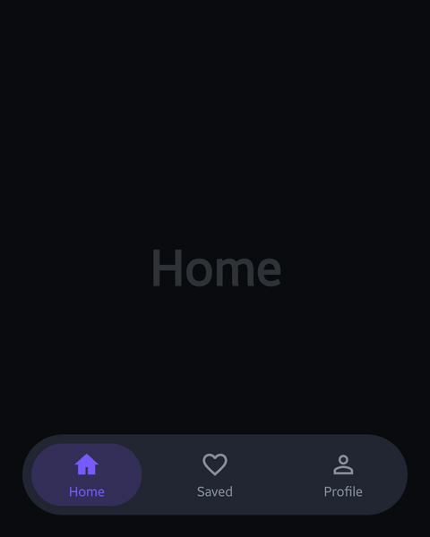 | **Morphing indicator.** The leading and trailing edges run on different springs. |
| 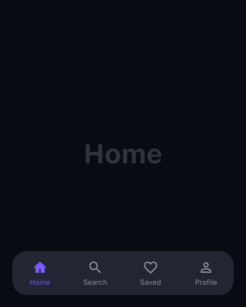 | **Animated icons.** A circular reveal of the filled icon, with a squash and bounce. |
| 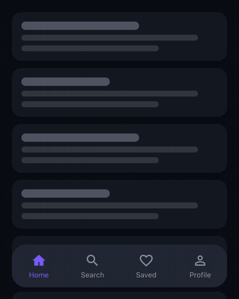 | **Collapse on scroll.** A nested-scroll observer shrinks the bar into a floating pill, and settles it to fully open or fully collapsed on release. |
| 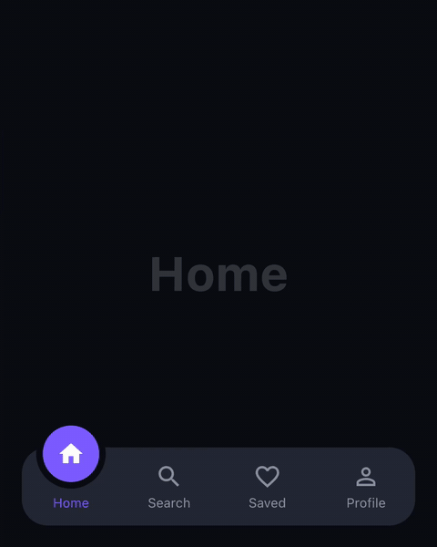 | **Moving cutout.** A notch cut with `Path.combine`, following the bubble. The notch itself rides a calm, non-bouncing centre while the bubble leans into its travel and bulges on landing. |
| 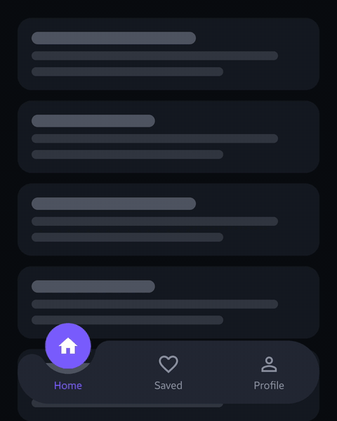 | **Cutout morph.** The notch hugs the bubble as it sinks into the bar, then hands off to an in-bar pill, riding that same calm centre while the bubble leans into its travel and bulges on landing. |
| 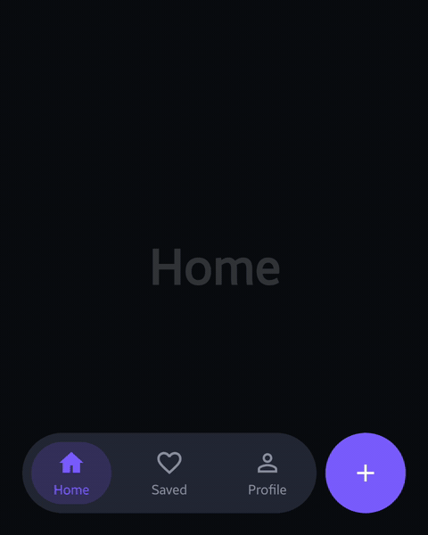 | **Action button.** A jelly button squirts out of the bar on tabs that have one, and shrinks the bar to make room. |
| 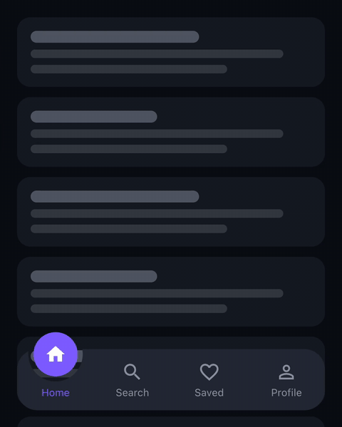 | **Everything together.** |
| 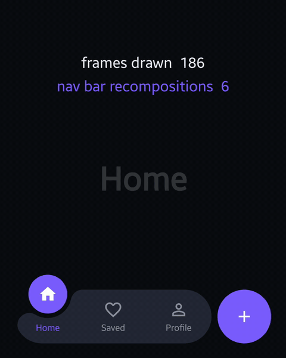 | **Frames vs recompositions.** Frames climb; the bar recomposes only on a tap. |

```kotlin
val items = listOf(
    NavItem(
        label = "Home",
        icon = Res.drawable.ic_home,
        selectedIcon = Res.drawable.ic_home_filled,
        action = NavAction(Res.drawable.ic_add, "New post"),
    ),
    NavItem(label = "Search", icon = Res.drawable.ic_search, selectedIcon = Res.drawable.ic_search),
    NavItem(label = "Saved", icon = Res.drawable.ic_saved, selectedIcon = Res.drawable.ic_saved_filled),
    NavItem(label = "Profile", icon = Res.drawable.ic_profile, selectedIcon = Res.drawable.ic_profile_filled),
)

val scrollState = rememberNavBarScrollState()

AnimatedNavBar(
    items = items,
    selectedIndex = selected,
    onSelect = { selected = it },
    onActionClick = { index -> /* the tapped tab's action fired */ },
    layers = NavBarLayers.All,
    scrollState = scrollState, // also add Modifier.nestedScroll(scrollState.nestedScrollConnection) to your list
)
```

## Profile gallery (`core/presentation/components/gallery/`)

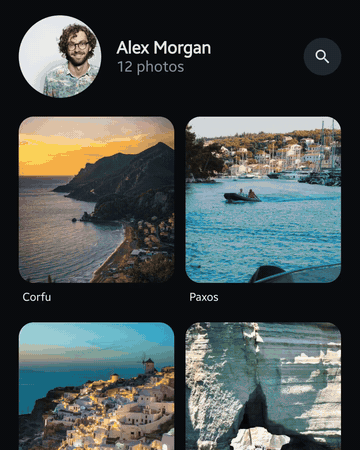

One screen where everything that opens is a shared-element morph, all in one `SharedTransitionLayout`:

- **Photo.** A grid card grows into the full-screen photo and back (a container transform). The corners are paired, so the card's 16 dp and the photo's 0 dp meet halfway instead of a square photo showing through a rounded card. The title and caption follow the photo as it grows.
- **Profile photo.** The avatar zooms into a large circle over a scrim. A pencil button then morphs into a "Change profile photo" dialog, and back into the button.
- **Search.** The search button grows into a bar, and search opens as its own page, cross-fading with the gallery. Recent searches show until the query types in, then the matching photos, which glide into place as each letter narrows them.
- **Collapsing header.** As the grid scrolls, the avatar shrinks into a top bar with a shadow, following the finger.

Taps are serialised by a morph gate: one that arrives mid-morph waits for the morph to land, so an interrupted transition never leaves a stray copy behind. Nothing recomposes while anything morphs or scrolls. The system back gesture closes the topmost layer.

```kotlin
ProfileGallery(
    name = "Alex Morgan",
    portrait = Res.drawable.portrait,
    photos = photos, // List<MorphPhoto>(image, title, caption)
    searchQuery = "xos",
    recentSearches = listOf("Santorini", "Milos", "Hydra"),
    scene = scene, // GalleryScene(photo, avatar, dialog, search)
    onSceneChange = { scene = it },
)
```

The photo morph also ships on its own as `ImageMorph` (`core/presentation/components/imagemorph/`), with `MorphLayers` to switch its fixes on one by one.

## Fogged mirror (`core/presentation/components/fog/`)

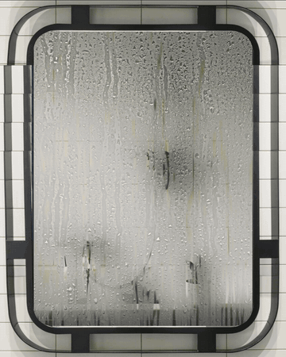

> **Try it with your own face.** The clip above is the Bathroom version, but the repo also has a camera version, **Your reflection**. Run the app on an Android phone, open *Fogged mirror → Your reflection*, and wipe the steam to find yourself standing in the bathroom, cut out of your own room on the phone. Leave it, and the steam comes back. Tap **Replay** to watch the clip play over your live face.

A steamed-up bathroom mirror, hanging on a tiled wall above the basin, that you wipe clear with a finger. Two versions share one component:

- **Bathroom** (`fog.mirror.bathroom`): a still bathroom behind the glass. It asks for nothing, and mists slowly back over once you stop wiping.
- **Your reflection** (`fog.mirror.camera`): the live front camera behind the glass, so wiping finds your face, standing in the bathroom: on Android, ML Kit's selfie segmentation cuts you out of each frame on the phone itself, and the bathroom shows behind you instead of your own room. Like the bathroom, it mists slowly back over once you stop wiping. One card explains why it needs the camera before asking; without it, the mirror shows the bathroom's still reflection.

What's on the glass:

- **Fog from a real photo.** Condensation texture from a photo of wet glass, over a blurred, milky copy of the scene behind it.
- **Soft wipes.** Soft-edged strokes follow the finger.
- **Mist.** Once you stop wiping, the steamy room slowly fogs the glass evenly back over. (`FogState` can also fill fog back in from the bottom up, like a breath; the demo doesn't use it.)
- **Running drops.** Now and then a drop gathers, in a range of small sizes, and runs down. The bigger it is, the faster it goes. As it runs it stretches from a sphere into a teardrop, and it cuts a clear trail through the fog behind it. Once it stops, it settles softly into the condensation.
- **Drops meeting a wipe.** A drop that runs into a wiped patch slips just inside, then spreads out slowly and thins away into the wet glass.
- **The clip.** Drops run first, then a hand scrubs a porthole clear, smearing away the drop resting in its path. A soft fingertip marks each touch, like a phone's "show taps". One more drop runs into the porthole and spreads away, then the room mists it all back over, so the clip loops. Replay in **Your reflection** plays the same showcase over your live face, ending with the same mist.

```kotlin
val fog = remember { FogState() }                   // starts fully fogged
val drips = remember(fog) { DripDriver(fog) }       // set drips.glass to the glass's size in dp,
                                                    // then drips.advance(seconds) on each frame

FoggedMirror(
    photo = painterResource(Res.drawable.mirror_view), // or the camera's live Painter
    state = fog,
    beads = { drips.beads },                         // read while drawing: a running drop only redraws
)
```

### Made with Compose

Compose made every part of this simple to build, and the same Kotlin runs on Android and iOS:

- **Blend modes are the whole fog.**
  - Inside an offscreen `graphicsLayer` (`CompositingStrategy.Offscreen`), `BlendMode.DstOut` wipes holes in the fog, `Overlay` lays the condensation texture on top, and `DstIn` thins it.
  - Breath and mist *fill back in* rather than pile up: `DstOut`, then `Plus` through a `SrcIn` mask, in `saveLayer` from `drawIntoCanvas`.
  - That's plain Porter–Duff maths, the same on both platforms.
- **`Modifier.blur` and `ColorFilter.colorMatrix`** turn one `Painter` into the misty copy of the scene. The camera is just another `Painter`, so the live mirror needed no special path.
- **Drops are drawn with ordinary draw calls.** Each teardrop is a `Path` of two cubics and an arc, drawn longer the faster it runs. Its shade, rim, edge light and glint are a filled path, strokes, an arc and a circle, and a settled drop gets a soft `Brush.radialGradient` halo. `withTransform` spreads it as it melts into a wipe.
- **Drawing never triggers recomposition.** Beads are handed over as a lambda and read in `drawBehind`. The fog's marks are a `mutableStateListOf` read in the draw phase, and camera frames sit in snapshot state that only `onDraw` reads. So a running drop or a new frame costs a redraw, not a recomposition.
- **Clocks and gestures are coroutines.**
  - `withFrameNanos` drives the drops and the mist.
  - `snapshotFlow` wakes the drip loop the moment you wipe, and otherwise lets the glass sleep.
  - `pointerInput` with `awaitEachGesture` follows each finger across the glass.
  - `repeatOnLifecycle` keeps the camera on only while the screen is showing.
- **Everything is testable.** `runComposeUiTest` plus `captureToImage` read real pixels: a drop is darker in the middle, a spread one is thinner and wider, and a wipe clears the fog. The drips and the mist run on the test's own frame clock, so a test steps through many seconds of drops frame by frame, exactly the same every run.
- **The mirror hangs on a real wall with ordinary layout.** `BoxWithConstraints` measures the screen. An `Image` with `ContentScale.Crop` and a custom `Alignment` crops the wall photo around the mirror. The glass is a `Box` placed with `Modifier.offset` and `size`, and clipped with `RoundedCornerShape`. So the fog lands exactly on the photo's glass on any screen, and a finger on the tiles wipes nothing.
- **A cut-out is just a blend mode.** The camera's frame and the person mask go into one layer, and `BlendMode.DstIn` keeps only you. A small `Painter` then draws the bathroom behind you, and the fog takes the result like any other picture.
- **`expect`/`actual`** keeps the platform code small: CameraX on Android, a stub on iOS. Everything you see is common code.

What makes Compose so good for this is that nothing here needed a custom view, an OpenGL shader or a platform escape hatch. The fog, the water and the wall are ordinary composables, modifiers and draw calls, laid out, animated and tested like any other screen, and one codebase draws them on both platforms. Compose makes a surface that feels physical and alive just another piece of UI.

## Page-turn book (`core/presentation/components/pageturn/`)

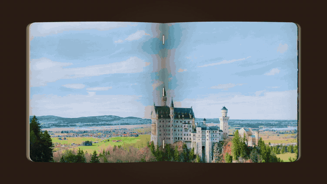

An open book whose pages turn in 3D under your finger, drawn in plain Compose `DrawScope` with no platform canvas, so the same code turns the page on Android and iOS.

- **A leaf of strips.** The turning page is 18 strips hinged end to end. Each one is drawn under its own perspective `Matrix` (the 3×3 projection written into Compose's 4×4 layout), so the page curls instead of flipping as a flat card.
- **The paper stays under your finger.** Take a page anywhere and the spot you took stays under the fingertip as it moves across: each move solves for the turn that puts it there. Seen in perspective, paper lifting off its page first drifts outwards, so the spot is placed as seen from above and then most of the way to the eye's view, and the first move never snaps the page up.
- **Where and how you hold it matters.** The bending lines can lean, fanning out from a point on the spine's line, so one corner peels first and curls tightest. Hold a top or bottom corner and that corner leads; slide your finger along the edge and the hold slides with it, so the lead moves to the other corner. Pull on a slant and the fold lies square to the pull, as paper does. Held near the spine the leaf turns stiff and flat; out at the edge it bends most around your fingers. Let go, and the lean straightens as the page falls, so it lands square.
- **Paper with a spring in it.** In a hand the paper sags back behind the fingers and rolls over calmly when you turn back; flying free, its edge trails in the air. Let go and the bow whips over from one to the other, a flick billows it, and it sways and settles.
- **Let go anywhere.** Past 0.42 of a turn, or on a flick, the page finishes; otherwise it sinks back. Both are critically damped springs, so a page lands without bouncing off the spine, and a page still landing can be caught mid-air.
- **A book of real leaves.** Every sheet is a leaf you can turn: the demo's book is the first sixteen pages of Winsor McCay's *Little Nemo in Slumberland*. The leaves lie in the curve of an open book, rising out of the gutter and cresting, each one under the top page a little flatter, so their edges fan out past it the way an open book's paper does, each showing its own page. As a leaf lifts, the sheets under it rise to take its place; as it lands, the stack it lands on settles under it. A turn starts and ends in that same curve, so no page ever snaps flat.
- **Light and binding.** Each strip shades by how far it faces away, with a sheen while it is up. The gutter darkens under a standing leaf, and the thread it is sewn with shows in its centre fold and only there.

Taps and drags go through one `PageTurnState`, so the demo's scripted drags take the same path as a finger.

```kotlin
val book = rememberPageTurnState(spreadCount = spreads.size)
PageTurnBook(
    spreads = spreads, // List<ImageBitmap?>, one 2:1 image across both pages, or null for blank paper
    state = book,
)
```

## Paper plane (`core/presentation/components/paperplane/`)

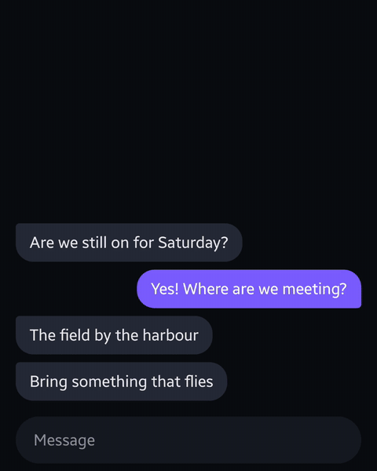

A chat that sends each message as a paper plane. Type, and a white paper dart appears on the send button; send, and the letters are drawn into the button one by one, the button swelling a little with each, then the dart itself lifts off, loops up the conversation and comes in low over the message's place, letting each letter go as it passes over it, before it flies off the screen.

- **A dart folded for real.** The plane is a sheet of paper folded into a classic dart: the corners in twice, in half, and the wings opened out into a V. Creased down the middle, paper springs back, so the dart's two halves stand a little apart about its spine. The sheet is cut along every crease into flat facets, each turned about its creases in 3D and drawn under its own perspective `Matrix`. Each rigid part of the dart is a stack of paper, drawn layer by layer as the eye sees it, so the flaps folded over the wings lie on top of them.
- **White paper, shaded by its own folds.** Paper is lit mostly by the room, from every side at once, so it stays white whichever way it turns. How much of the room each side of each facet sees is worked out once, by casting rays out from it past the rest of the dart, so it falls into shade only where its own paper stands over it: in the V between the folds and on the keel under the wings. A little window light turns it a touch brighter towards one side. A faint grain and its fibres are mapped onto every facet, and the dart casts a soft-edged shadow on the conversation that spreads the higher it flies.
- **The icon is the plane.** The send button shows the folded dart itself, seen close up three-quarters from behind, and the plane takes off from exactly that pose and camera, then eases back to its own as it grows. The button grows with each letter it takes in, as far as the field has room for it, and the dart lifts off at that size.
- **A throw, not a tween.** It is thrown hard off the button and slows along the loop, so it comes in over the message at the pace it drops letters at. Its nose follows its climb off the screen and its glide back down, and it banks as a glider does, by its speed and how tight it turns (`tan bank = v²κ / g`), rolling in and out with a lag. It never quite flies steady: it rocks, yaws and drifts a little, at its own pace on each.
- **Letters that fall.** Each letter is let go a little before its place and carried on by the plane, slowed by the air, falling faster as it goes, tumbling out of its spin and growing back to its size. It lands exactly on the text it stands in for, and the bubble grows in behind the letters as they land. However long the message, the last letter lands within 0.6 s of the first.
- **No jump.** The message's place stays shut while its letters go into the button and its plane flies round. It opens as the plane comes down to it, laid out full height at its foot the whole while, so the conversation moves up just in time and the plane flies to where the message will stay.

Planes fly side by side: send again while one is up and the next takes off with its own message.

```kotlin
val planes = rememberPaperPlaneState()
val letters = rememberLetterStream()
// In the send button: the dart a plane lifts off as, grown with the letters it takes in,
// no further than its field has room for.
PaperPlaneIcon(color = paper, modifier = Modifier.size(26.dp).graphicsLayer { scaleX = grow; scaleY = grow })
val most = iconRoom(iconBounds, fieldOutline, inset = 3.dp.toPx(), most = 1.6f)
// The message's place in the list: shut until its plane comes down to it.
Modifier.planeLanding(planes, key)
// On send: the typed letters into the button, then the plane with the landed text's layout.
letters.pour(draftLayout, draftOrigin, into = { button.center }, arrived = {})
planes.launch(key, planeTakeoff(grownIconBounds), landedLayout, at = { landedOrigin })
// Over everything: where the letters and the planes are drawn.
LetterStage(letters, Modifier.fillMaxSize())
PaperPlane(planes, paper = paper, Modifier.fillMaxSize())
```

## Moodboard: native on both platforms (`moodboard/`)

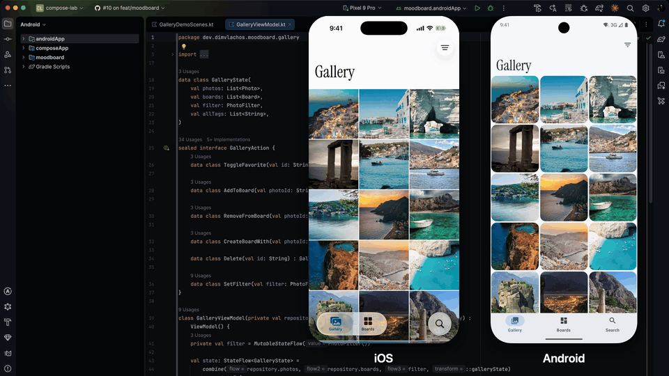

**The point:** the right way to build a Kotlin Multiplatform app is to share what users never see and keep what they touch native. An iPhone user and an Android user should both feel at home: the same app and the same features, with each platform's own components, gestures and motion. Not one UI drawn the same on both.

Moodboard is a photo moodboard (gallery, boards, search) built that way. One Kotlin codebase holds the data, the logic and one MVI ViewModel per screen. Each platform draws its own chrome on top.

| Feature | iOS | Android |
|---|---|---|
| Tabs | Liquid Glass `TabView` that shrinks on scroll, search as its own tab | Material 3 Expressive short navigation bar, cross-fading tabs |
| Screen title | Big title that scrolls with the content, inline title in a glass bar | Large app bar that collapses into a small one |
| Open a photo | System zoom transition from the cell | Container-transform morph from the cell, staying under the bars |
| Inner screens | Native push with swipe back | Parallax push with predictive back |
| Photo menu | `.contextMenu` with a lifted preview | `DropdownMenu` on long press |
| Delete a photo | `.alert` | `AlertDialog` |
| Delete a board | `.confirmationDialog` | `ModalBottomSheet` |
| Filter | Detent sheet | `ModalBottomSheet` (same shared Compose body) |
| Search | `.searchable` with suggestions | Search bar with recent searches and tags first, results as you type |
| Share | `ShareLink` | Share sheet via `FileProvider` |

**What's shared, and what isn't:**

- **Shared** (`moodboard/shared`): the repository, the ViewModels, and three Compose screens with no native-chrome dependency, hosted inside SwiftUI on iOS (photo detail, filter sheet, board editor). SwiftUI observes the ViewModels through [SKIE](https://skie.touchlab.co), so a native toolbar and the hosted Compose content read one state and never disagree.
- **Native on iOS** (`moodboard/iosApp`): a SwiftUI shell for iOS 26. Its grids and lists are SwiftUI so the glass bars, context menus and zoom transition attach to real native views.
- **Native on Android** (`moodboard/androidApp`): Compose with Material 3 Expressive and Navigation 3. Each tab keeps its own back stack, like an iOS `TabView`.
- **One brand across both:** an Aegean blue accent (a full Material scheme on Android, the app tint on iOS), Instrument Serif on the big titles while body text keeps each platform's system font, and one app icon. They read as the same app; neither imitates the other.

Run it:

- Android: `./gradlew :moodboard:androidApp:installDebug`
- iOS: `cd moodboard/iosApp && xcodegen && open Moodboard.xcodeproj` (iOS 26)
- Tests: `./gradlew :moodboard:shared:iosSimulatorArm64Test :moodboard:androidApp:testDebugUnitTest`
- iOS UI walk-through: `xcodebuild -project moodboard/iosApp/Moodboard.xcodeproj -scheme Moodboard -destination 'platform=iOS Simulator,name=iPhone 17 Pro' test` (set `TEST_RUNNER_SCREENSHOT_DIR` to save a screenshot per step)
- The showcase clip: both apps play one 41 s script, step for step.
  - Android: `scripts/moodboard/showcase-android.py out/moodboard-android.mp4` (an emulator records full resolution on the host).
  - iOS: record with `xcrun simctl io booted recordVideo out/moodboard-ios.mov` while running `TEST_RUNNER_SHOWCASE=1 xcodebuild … test -only-testing:MoodboardUITests/ShowcaseUITests`.
  - `scripts/moodboard/showcase-compose.sh out/moodboard-ios.mov <iosStart> out/moodboard-android.mp4 <androidStart> <android-studio.png> out/moodboard.showcase-both.mp4` (each start is the second, in that take, at which its script began: the first scroll), then the GIF at 12 fps and 960 px wide (`scripts/gif.sh` builds the palette in memory, which a 40 s clip can outgrow; ffmpeg's two-pass palettegen/paletteuse makes the same GIF).

## Run

Prerequisites: macOS with Xcode for iOS and for the iOS tests (`iosSimulatorArm64Test`), an Android SDK (`ANDROID_HOME` or `local.properties`'s `sdk.dir`), Python 3 and ffmpeg for recording, and [XcodeGen](https://github.com/yonaskolb/XcodeGen) for iOS.

- Android: `./gradlew :androidApp:installDebug`
- iOS: boot a simulator, then run `scripts/install-ios.sh`
- Tests: `./gradlew :composeApp:iosSimulatorArm64Test`
- Architecture (Konsist): `./gradlew :androidApp:testDebugUnitTest`
- Formatting: `./gradlew spotlessApply`

## Record a clip

Every demo plays a timed script that ends where it started, so clips loop cleanly.

```bash
scripts/record.py android navbar.all              # out/navbar.all-android.mp4 (1080×1350, 60 fps, ≤ 5 MB)
scripts/record.py ios navbar.all
scripts/record.py android navbar.all --label && scripts/record.py ios navbar.all --label
scripts/side-by-side.sh navbar.all                 # out/navbar.all-both.mp4
scripts/gif.sh navbar.all                          # docs/media/navbar.all.gif
scripts/record.py android book.turn --landscape    # a landscape demo: 1920×1080 (Android only)
```

Needs Python 3 and ffmpeg.

## Envelope

The nav bar supports 2–4 tabs, at a minimum slot width of about 64 dp.

The profile gallery shows photos in 2 columns of 4:5 cards. Opening one photo straight from another is not a morph: close to the grid first.

The page-turn book shows a two-page spread, 2:1, each spread one image; for crisp strips, give it images whose width divides by 36. It turns one leaf at a time: a tap while a page is still landing lands it at once and turns the next.

The paper plane carries one message of any length; a bubble up to 264 dp wide comes down within its 0.6 s whatever its length, the plane crossing it faster for a long one. The message field grows to 4 lines, 2 on a short screen, and scrolls past that; only the letters it shows are poured into the button. Messages are dropped from the left, whatever the script's direction.

## Licence

MIT. Icon path data comes from Material Icons (Apache 2.0). On Android, the fogged mirror finds you in the camera with Google's [ML Kit selfie segmentation](https://developers.google.com/ml-kit/vision/selfie-segmentation), on the phone; the app has no internet permission, so nothing it sees leaves the phone.

The page-turn book's pages are Winsor McCay's *Little Nemo in Slumberland*, the New York Herald Sunday pages of 15 October 1905 to 4 February 1906 (1905-12-03 from a smaller scan, 1906-01-28 left out), public domain, from the scans on [Wikimedia Commons](https://commons.wikimedia.org/wiki/Category:Little_Nemo_in_Slumberland).

Photos from [Unsplash](https://unsplash.com), used under the [Unsplash licence](https://unsplash.com/license) (the island photos are also bundled in the Moodboard):

| Photo | Photographer |
|---|---|
| [Portrait](https://unsplash.com/photos/DItYlc26zVI) | Christian Buehner |
| [Corfu](https://unsplash.com/photos/vhRn4aDempw) | Tobias Reich |
| [Paxos](https://unsplash.com/photos/bs1aa6L9rPM) | Luke Moss |
| [Santorini](https://unsplash.com/photos/6N2mSJsKTtA) | James Ting |
| [Milos](https://unsplash.com/photos/0lq90N_B1XE) | Despina Galani |
| [Naxos](https://unsplash.com/photos/dGD7R9R4ZiI) | Sebastiano Corti |
| [Hydra](https://unsplash.com/photos/jfnTAhvysZI) | Despina Galani |
| [Mykonos](https://images.unsplash.com/photo-1601581875309-fafbf2d3ed3a) | Johnny Africa |
| [Crete](https://images.unsplash.com/photo-1575237402880-4b496a83ae04) | Joshua Kettle |
| [Rhodes](https://images.unsplash.com/photo-1572375901777-1b257481cbb0) | Vlad Kiselov |
| [Zakynthos](https://images.unsplash.com/photo-1612279427382-f8349a383af8) | Julian Timmerman |
| [Kefalonia](https://images.unsplash.com/photo-1598959594958-34761147b7b0) | Mac McDade |
| [Folegandros](https://images.unsplash.com/photo-1688765866663-0fd353e7d5df) | Tom Waldek |

Photos from [Pexels](https://www.pexels.com), used under the [Pexels licence](https://www.pexels.com/license/):

| Photo | Photographer |
|---|---|
| [Houseplants in pots standing in a bathtub](https://www.pexels.com/photo/15618010/) (the bathroom in the fogged mirror: on its own, or behind you, cut out of the camera) | nana |
| [Contemporary bathroom interior with mirror above washbasin at home](https://www.pexels.com/photo/7046159/) (the wall the fogged mirror hangs on, extended with more tiles above and a counter front below) | Max Vakhtbovych |
| [Water droplets on foggy glass](https://www.pexels.com/photo/water-droplets-on-foggy-glass-8628343/) (the fog's condensation, via `scripts/fog-texture.py`) | Chris F |

The Moodboard's display face is [Instrument Serif](https://github.com/Instrument/instrument-serif) (SIL Open Font License 1.1, licence bundled at `moodboard/shared/src/commonMain/composeResources/files/licenses/`).

The Moodboard's mainland photos are from [Wikimedia Commons](https://commons.wikimedia.org), cropped to 640×800. The cropped files (`moodboard/shared/src/commonMain/composeResources/files/photos/photo_{meteora,meteora_night,delphi,acropolis,nafplio,monemvasia,vikos,kalogeriko}.jpg`) stay under the Creative Commons licence listed for each, not the repo's MIT licence:

| Photo | Author | Licence |
|---|---|---|
| [Meteora](https://commons.wikimedia.org/wiki/File:Meteora_Agios_Triadas_IMG_7632.jpg) | Dido3 | [CC BY-SA 3.0](https://creativecommons.org/licenses/by-sa/3.0) |
| [Meteora at Night](https://commons.wikimedia.org/wiki/File:%CE%9C%CE%B5%CF%84%CE%B5%CF%89%CF%81%CE%B1_by_night.jpg) | Argiriskaramouzas | [CC BY-SA 4.0](https://creativecommons.org/licenses/by-sa/4.0) |
| [Delphi](https://commons.wikimedia.org/wiki/File:Delphi_BW_2017-10-08_11-49-24.jpg) | Berthold Werner | [CC BY-SA 3.0](https://creativecommons.org/licenses/by-sa/3.0) |
| [Acropolis](https://commons.wikimedia.org/wiki/File:Akropolis_fra_Pnyx_2017_(1).jpg) | Peulle | [CC BY-SA 4.0](https://creativecommons.org/licenses/by-sa/4.0) |
| [Nafplio](https://commons.wikimedia.org/wiki/File:%CE%9D%CE%B1%CF%8D%CF%80%CE%BB%CE%B9%CE%BF_7834.jpg) | C messier | [CC BY-SA 4.0](https://creativecommons.org/licenses/by-sa/4.0) |
| [Monemvasia](https://commons.wikimedia.org/wiki/File:%CE%9C%CE%BF%CE%BD%CE%B5%CE%BC%CE%B2%CE%B1%CF%83%CE%B9%CE%AC_0412.jpg) | C messier | [CC BY-SA 4.0](https://creativecommons.org/licenses/by-sa/4.0) |
| [Vikos Gorge](https://commons.wikimedia.org/wiki/File:Vikos_Gorge_(%CE%A6%CE%B1%CF%81%CF%81%CE%AC%CE%B3%CE%B3%CE%B9_%CF%84%CE%BF%CF%85_%CE%92%CE%AF%CE%BA%CE%BF%CF%85)_by_Pudelek_2.JPG) | Pudelek | [CC BY-SA 4.0](https://creativecommons.org/licenses/by-sa/4.0) |
| [Kalogeriko Bridge](https://commons.wikimedia.org/wiki/File:Old_Bridge_Kalogeriko.jpg) | Jolovema | [CC BY-SA 4.0](https://creativecommons.org/licenses/by-sa/4.0) |
